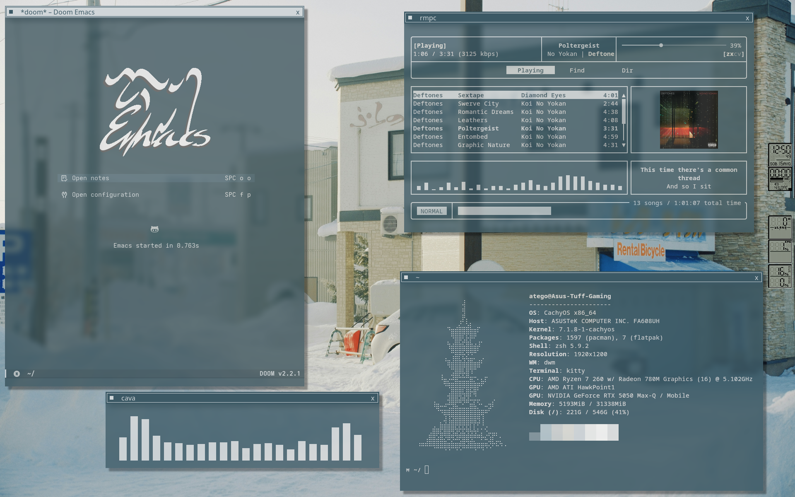
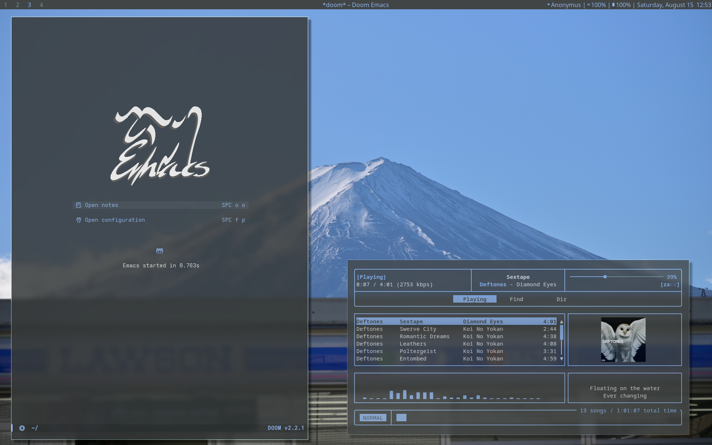

# dwm - dynamic window manager - atego's build

 

A heavily customized build of [dwm](https://dwm.suckless.org/), focused on keyboard-driven window management, integrated scripts, DockApps, dynamic theming, and a WindowMaker-inspired desktop mode.

The configuration is designed to provide a complete desktop workflow while retaining dwm's lightweight and configurable architecture.

---

## Overview

This build extends dwm with:

- Vanity gaps
- Multiple layouts
- Multi-monitor support
- Sticky windows
- Fullscreen handling
- Dynamic Xresources/pywal colours
- dwmblocks statusbar
- Automatic application rules
- Custom application keybinds
- Screenshot and recording utilities
- Audio and input switching
- Hardware brightness controls
- Integrated DockApps
- Custom startup services
- Emacs daemon integration
- MPD and audio-device status monitoring
- WindowMaker-inspired **Maximalist Mode**

The configuration is primarily controlled through `config.h`.

---

# Getting Started

## Mod Key

`Mod` refers to the **Super/Windows key**.

dwm is primarily operated through keyboard shortcuts. The most important controls are:

| Keybind               | Action                           |
| --------------------- | -------------------------------- |
| `Mod + Enter`         | Open kitty                       |
| `Mod + P`             | Launch dmenu                     |
| `Mod + Q`             | Close focused window             |
| `Mod + J / K`         | Navigate the window stack        |
| `Mod + 1-9`           | Switch tags                      |
| `Mod + Shift + J / K` | Push focused window in stack     |
| `Mod + Shift + Space` | Toggle floating                  |
| `Mod + F`             | Toggle fullscreen                |
| `Mod + Ctrl + Shift + M` | Toggle Maximalist Mode        |
| `Mod + Alt + M`       | Toggle spawn-at-max-size         |

---

# Window Management

dwm automatically arranges windows according to the active layout.

The default configuration uses a master/stack arrangement with:

- `55%` master area factor
- `1` master window
- `20px` inner horizontal gap
- `20px` inner vertical gap
- `20px` outer horizontal gap
- `30px` outer vertical gap

### Master Area

| Keybind              | Action                           |
| -------------------- | -------------------------------- |
| `Mod + H`            | Decrease master area / previous corner |
| `Mod + L`            | Increase master area / next corner |
| `Mod + Shift + I`    | Increase master window count     |
| `Mod + Ctrl + I`     | Decrease master window count     |
| `Mod + Ctrl + Space` | Focus master window              |

### Floating Window Resize

| Keybind               | Action                   |
| --------------------- | ------------------------ |
| `Mod + Ctrl + Right`  | Expand right edge outward |
| `Mod + Ctrl + Left`   | Shrink right edge back in |
| `Mod + Ctrl + Down`   | Expand bottom edge outward |
| `Mod + Ctrl + Up`     | Shrink bottom edge back in |
| `Mod + Shift + Left`  | Expand left edge outward  |
| `Mod + Shift + Right` | Shrink left edge back in  |
| `Mod + Shift + Up`    | Expand top edge outward   |
| `Mod + Shift + Down`  | Shrink top edge back in   |

### Window State

| Keybind                  | Action               |
| ------------------------ | -------------------- |
| `Mod + F`                | Toggle fullscreen    |
| `Mod + Shift + Space`    | Toggle floating      |
| `Mod + Ctrl + Shift + L` | Toggle sticky window |
| `Mod + R`                | Toggle shade (notch) |
| `Mod + Ctrl + Shift + F` | Toggle focus-on-hover |

---

# Tags

This configuration provides nine tags.

| Keybind                    | Action                          |
| -------------------------- | ------------------------------- |
| `Mod + 1-9`                | View tag                        |
| `Mod + Ctrl + 1-9`         | Toggle tag in current view      |
| `Mod + Shift + 1-9`        | Move focused window to tag      |
| `Mod + Ctrl + Shift + 1-9` | Toggle focused window on tag    |
| `Mod + 0`                  | View all tags                   |
| `Mod + Shift + 0`          | Move focused window to all tags |
| `Mod + Tab`                | Switch to previously viewed tag |

---

# Gaps

Vanity gaps are enabled by default.

| Keybind           | Action               |
| ----------------- | -------------------- |
| `Mod + G`         | Decrease gaps by 3px |
| `Mod + Shift + G` | Increase gaps by 3px |

The default gap configuration is:

| Gap              | Size |
| ---------------- | ---: |
| Inner horizontal | 20px |
| Inner vertical   | 20px |
| Outer horizontal | 20px |
| Outer vertical   | 30px |

`Mod + Middle Click` on a client resets the default gaps.

---

# Multi-Monitor

| Keybind           | Action                          |
| ----------------- | ------------------------------- |
| `Mod + [`         | Focus next monitor              |
| `Mod + ]`         | Focus previous monitor          |
| `Mod + Shift + [` | Move window to next monitor     |
| `Mod + Shift + ]` | Move window to previous monitor |

---

# Maximalist Mode

**Maximalist Mode** is a custom WindowMaker-inspired environment integrated directly into this dwm build.

It is intended to combine dwm's window management with the traditional floating desktop and DockApp workflow associated with WindowMaker.

| Keybind                  | Action                       |
| ------------------------ | ---------------------------- |
| `Mod + Ctrl + Shift + M` | Toggle Maximalist Mode       |
| `Mod + Shift + M`        | Grow focused window          |
| `Mod + Ctrl + M`         | Shrink focused window        |
| `Mod + Alt + M`          | Toggle spawn-at-max-size     |

When enabled, dwm launches:

```text
~/.config/scripts/wm-dock.sh
```

The script manages the DockApp environment.

DockApps receive dedicated window rules that can provide:

- Floating behaviour
- Sticky behaviour
- Always-below behaviour
- Focus exclusion
- Fullscreen exclusion
- Maximalist-mode exclusion
- Persistent positioning

Configured DockApps include:

- `wmbatteries`
- `wmcpuload`
- `wmmemload`
- `wmnetload`
- `wmclockmon`
- `wmtz`
- `wmweather+`
- `wminfo`
- `wmail`
- `WMmp`

This allows Maximalist Mode to function as a WindowMaker-style desktop environment while retaining dwm as the underlying window manager.

---

# Layouts

The build contains the following layouts:

| Layout   | Function                        |
| -------- | ------------------------------- |
| Tile     | Standard tiled layout           |
| Floating | Floating layout                 |
| Monocle  | Single-window fullscreen layout |
| Spiral   | Spiral tiling                   |
| Dwindle  | Dwindle tiling                  |

The direct layout-switching keybinds are currently disabled in `config.h`.

---

# Applications

| Keybind                  | Application / Function      |
| ------------------------ | --------------------------- |
| `Mod + M`                | opencode (in kitty)         |
| `Mod + B`                | Helium browser              |
| `Mod + D`                | Discord (concord)           |
| `Mod + Shift + D`        | Vesktop                     |
| `Mod + E`                | Emacs client (large, floating) |
| `Mod + Ctrl + E`         | Emacs Everywhere            |
| `Mod + Shift + B`        | System stats (ptui in kitty) |
| `Mod + C`                | Camera preview              |
| `Mod + Shift + F`        | Nautilus                    |
| `Mod + Shift + R`        | Screen recording            |
| `Mod + Shift + W`        | Wallpaper picker            |
| `Mod + Ctrl + Shift + W` | OnlyOffice                  |
| `Mod + T`                | Toggle kitty transparency   |
| `Mod + Shift + T`        | Toggle trackpad             |
| `Mod + Right Shift`      | Power menu                  |

---

# Audio & Input

| Keybind       | Action                 |
| ------------- | ---------------------- |
| `Mod + O`     | Switch audio output    |
| `Mod + I`     | Switch audio input     |
| `Volume Mute` | Toggle output mute     |
| `Volume Down` | Decrease volume by 5%  |
| `Volume Up`   | Increase volume by 5%  |
| `Mic Mute`    | Toggle microphone mute |

Audio changes trigger a dwmblocks refresh.

---

# Screenshots & Recording

| Keybind           | Action                  |
| ----------------- | ----------------------- |
| `Mod + Shift + S` | Full screenshot         |
| `Mod + Ctrl + S`  | Selection screenshot    |
| `Mod + F2`        | Screenshot              |
| `Mod + Shift + R` | Toggle screen recording |

---

# Brightness

| Key               | Action                    |
| ----------------- | ------------------------- |
| `Brightness Up`   | Increase brightness by 1% |
| `Brightness Down` | Decrease brightness by 1% |

---

# Statusbar

The build uses **dwmblocks** for the statusbar.

| Keybind          | Action                       |
| ---------------- | ---------------------------- |
| `Mod + Ctrl + B` | Toggle top bar               |
| `Mod + Ctrl + T` | Toggle dwmblocks status text |
| `Mod + Ctrl + X` | Reload Xresources colours    |

The colour scheme can be restored dynamically through the configured pywal/Xresources integration.

---

# Gmail

| Keybind    | Action     |
| ---------- | ---------- |
| `Mail`     | Open Gmail |
| `Mod + F9` | Open Gmail |

---

# Mouse Controls

| Input                          | Action               |
| ------------------------------ | -------------------- |
| `Mod + Left Click`             | Move client          |
| `Mod + Middle Click`           | Reset gaps           |
| `Mod + Right Click`            | Resize client        |
| `Middle Click` on window title | Promote client       |
| `Middle Click` on root window  | Toggle bar           |
| `Left Click` on tag            | View tag             |
| `Right Click` on tag           | Toggle tag           |
| `Mod + Left Click` on tag      | Move client to tag   |
| `Mod + Right Click` on tag     | Toggle client on tag |

---

# System Controls

| Keybind                   | Action              |
| ------------------------- | ------------------- |
| `Mod + BackSpace`         | Lock screen         |
| `Mod + Shift + BackSpace` | Exit dwm            |
| `Mod + Ctrl + Shift + Q`  | Restart/refresh dwm |

---

# Startup

The configuration automatically starts and manages the following components:

- pywal colour restoration
- Wallpaper restoration
- picom
- dwmblocks
- Theme restoration
- numlock
- Dark mode
- dunst
- Battery monitoring
- Emacs daemon
- MPD player monitoring
- Audio-device monitoring
- Microphone monitoring
- XDG desktop portal

This allows the desktop session to be restored automatically when dwm starts.

---

# Window Rules

Applications can be assigned specific behaviour through the `rules[]` section of `config.h`.

Rules can control properties such as:

- Floating state
- Monitor assignment
- Sticky state
- Focus behaviour
- Fullscreen behaviour
- Border behaviour
- Maximalist Mode behaviour
- DockApp behaviour

This build contains dedicated rules for its custom applications, utilities, media applications, Emacs windows, and DockApps.

---

# Configuration

dwm is configured primarily through `config.h`.

The configuration contains:

- Appearance settings
- Fonts
- Colours
- Tags
- Layouts
- Keybinds
- Mouse bindings
- Application commands
- Window rules
- Startup applications
- Maximalist Mode configuration

Changes to `config.h` require rebuilding dwm. (doing "sudo make clean install")

The custom refresh keybind is:

```text
Mod + Ctrl + Shift + Q
```

---

# Quick Reference

| Keybind                    | Action                       |
| -------------------------- | ---------------------------- |
| `Mod + Enter`              | Terminal                     |
| `Mod + P`                  | dmenu                        |
| `Mod + Q`                  | Kill focused window          |
| `Mod + Shift + Q`          | Kill unfocused windows       |
| `Mod + J / K`              | Navigate windows             |
| `Mod + Shift + J / K`      | Move windows in stack        |
| `Mod + Tab`                | Previous tag view            |
| `Mod + 1-9`                | Switch tag                   |
| `Mod + Shift + 1-9`        | Move window to tag           |
| `Mod + Ctrl + 1-9`         | Toggle tag                   |
| `Mod + Ctrl + Shift + 1-9` | Toggle window on tag         |
| `Mod + 0`                  | View all tags                |
| `Mod + Shift + 0`          | Move window to all tags      |
| `Mod + H / L`              | Master area size / corner    |
| `Mod + Shift + I`          | Increase master count        |
| `Mod + Ctrl + I`           | Decrease master count        |
| `Mod + Ctrl + Space`       | Focus master                 |
| `Mod + Shift + Space`      | Toggle floating              |
| `Mod + F`                  | Fullscreen                   |
| `Mod + Ctrl + Shift + L`   | Sticky window                |
| `Mod + R`                  | Toggle shade (notch)         |
| `Mod + Ctrl + Shift + F`   | Toggle focus-on-hover        |
| `Mod + G`                  | Decrease gaps                |
| `Mod + Shift + G`          | Increase gaps                |
| `Mod + [ / ]`              | Change monitor               |
| `Mod + Shift + [ / ]`      | Move window between monitors |
| `Mod + Ctrl + Shift + M`   | Maximalist Mode              |
| `Mod + Shift + M`          | Grow focused window (maximalist) |
| `Mod + Ctrl + M`           | Shrink focused window (maximalist) |
| `Mod + Alt + M`            | Toggle spawn-at-max-size     |
| `Mod + Ctrl + B`           | Toggle bar                   |
| `Mod + Ctrl + T`           | Toggle status text           |
| `Mod + Ctrl + X`           | Reload colours               |
| `Mod + BackSpace`          | Lock screen                  |
| `Mod + Shift + BackSpace`  | Exit dwm                     |
| `Mod + Ctrl + Shift + Q`   | Restart/refresh dwm          |

---

# External Files

External files mentioned in config.h will be all placed in a folder called CONFIG
This file will mimic my $HOME directory, for ease of acces to the files and no need to look into other dotfiles

---

# Dependencies

## Build-time (to compile dwm)

- A C compiler (`cc` / `gcc` / `clang`)
- `make`
- Development packages for:
  - `libX11` — core X11 protocol (`Xlib.h`)
  - `libXinerama` — multi-monitor support
  - `libXft`, `fontconfig`, FreeType — font rendering
  - `libX11-xcb`, `libxcb`, `libxcb-res` — xcb support / system trays
- X11 headers under `/usr/X11R6/include` and `/usr/include/freetype2`

## Runtime libraries

- `libX11`
- `libXinerama`
- `libXft`
- `libxcb`, `libxcb-res`, `libX11-xcb`
- `fontconfig`, FreeType

## Companion programs wired into config.h

Core window-manager environment:

- `dmenu` — application launcher
- `kitty` — default terminal
- `dwmblocks` — statusbar
- `picom` — compositor
- `dunst` — notifications
- `pywal` (`wal`) + `xrdb` — dynamic colours
- `feh` — wallpaper
- `slock` — lock screen
- `numlockx`, `xset`, `xinput`

Audio / media:

- `pactl` — volume, mute, mic, sink/source switching (PulseAudio / PipeWire-pulse)
- `brightnessctl` — screen brightness
- `mpc` + MPD — player-change watcher
- `qmmp` — WMmp dockapp bridge

Applications launched via keybinds:

- `opencode`
- `helium-browser` (also used for the Gmail bind)
- `concord` (Discord client)
- `vesktop`
- `nautilus`
- `onlyoffice-desktopeditors`
- `ptui` (system stats, run inside kitty)
- `emacs` + `emacsclient` (`emacs-everywhere`)

Startup / desktop services:

- `xdg-desktop-portal-gtk`
- `gsettings` (GNOME dark-mode)

DockApps (WindowMaker-style, spawned by `~/.config/scripts/wm-dock.sh` in Maximalist Mode):

- `wmbatteries`
- `wmcpuload`
- `wmmemload`
- `wmnetload`
- `wmclockmon`
- `wmclock`
- `wmtz`
- `wmweather+`
- `wminfo`
- `wmail`
- `WMmp`

External scripts referenced from `config.h` live in `~/.config/scripts/` (mirrored in the `CONFIG/` folder) and pull in their own tooling (screenshot/recording utilities, etc.).

## Fonts

- `Iosevka Nerd Font`
- `Noto Color Emoji`
